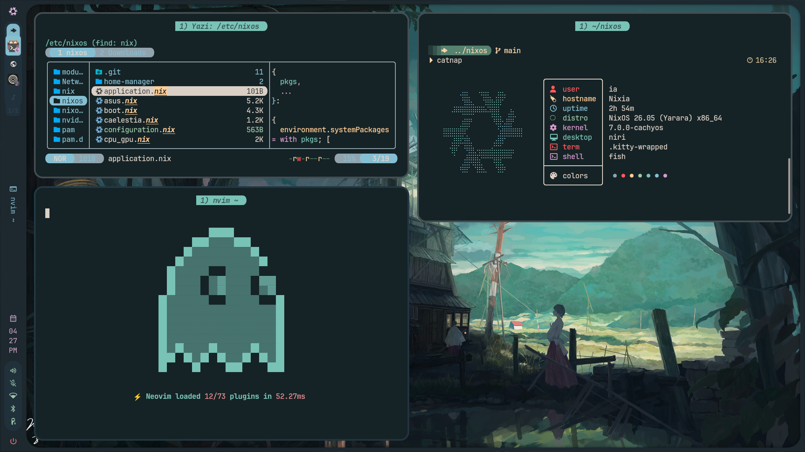

# Nixia

NixOS flake-based configuration for a personal desktop/laptop.
- **Version**: **26.05 (Yarara)**
- **Channel**: **NixOS-Unstable**

## Configuration Structure

| File | Description |
|------|-------------|
| `configuration.nix` | Main entry point, imports all modules |
| `hardware-configuration.nix` | Generated hardware config (file systems, modules) |
| `boot.nix` | Bootloader, kernel, boot parameters |
| `cpu_gpu.nix` | NVIDIA configuration and power management, PRIME offload |
| `asus.nix` | ASUS-specifics: asusd, supergfxd |
| `network.nix` | NetworkManager, DNSCrypt, SpoofDPI |
| `desktop.nix` | niri, quickshell, fonts, themes |
| `caelestia.nix` | Caelestia quickshell configuration |
| `user.nix` | User accounts, groups |
| `application.nix` | Generic applications |
| `dev.nix` | Development tools |
| `multimedia.nix` | Multimedia configurations |
| `util.nix` | Utilities |

## Desktop Environment

- **Window Manager**: **Niri** Scrolling Window Manager
- **Desktop Shell**: My fork of Caelestia (QuickShell)
- **Shell**: **Fish**, friendly interactive shell
- **File Manager**: **Yazi** and **Thunar**
- **Terminal**: **Kitty**
- **Editor**: **LazyVim** (NeoVim distro)
- **Network**: **DNSCrypt** & **SpoofDPI**
- **System Monitoring**: **BTOP**
- **Browser**: **Zen Browser**
